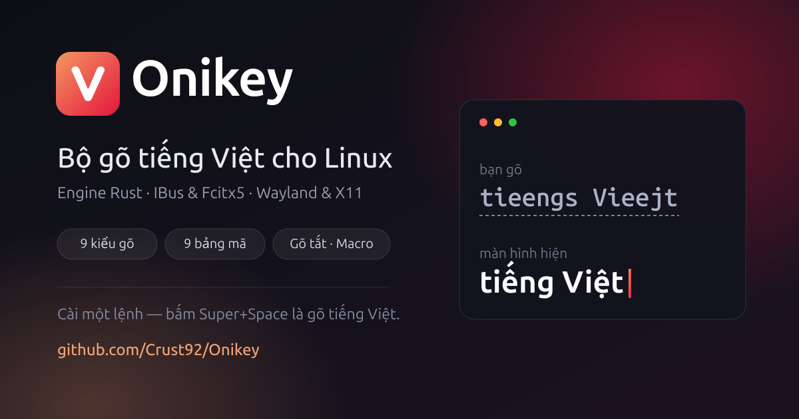

<p align="center">
  
</p>

<p align="center">
  <a href="https://opensource.org/licenses/GPL-3.0"></a>
</p>

Bộ gõ tiếng Việt cho **IBus** (GNOME, Ubuntu…) và **Fcitx5** (KDE…), engine
viết bằng Rust. Cách gõ kế thừa từ [BambooEngine](https://github.com/BambooEngine/bamboo-core);
kho này giữ giấy phép **GPLv3**.

## Cài đặt / Cập nhập

**Nhanh nhất — mọi distro, một dòng** (tải bản dựng sẵn từ GitHub Releases,
kiểm checksum rồi cài; không cần trình biên dịch, không thêm kho phần mềm):
```sh
curl -fsSL https://raw.githubusercontent.com/Crust92/Onikey/master/scripts/get-onikey.sh | sh
```
Muốn cài riêng cho mình, khỏi cần `sudo`:
`curl -fsSL .../get-onikey.sh | ONIKEY_PREFIX=~/.local sh`

**Ubuntu/Debian — cài một lần, về sau `apt upgrade` tự lên bản mới:**
```sh
curl -fsSL https://crust92.github.io/Onikey/onikey-archive-keyring.gpg \
  | sudo tee /usr/share/keyrings/onikey-archive-keyring.gpg >/dev/null
echo "deb [signed-by=/usr/share/keyrings/onikey-archive-keyring.gpg] https://crust92.github.io/Onikey stable main" \
  | sudo tee /etc/apt/sources.list.d/onikey.list
sudo apt update
sudo apt install onikey          # cho IBus (GNOME)
sudo apt install fcitx5-onikey   # cho Fcitx5 (KDE)
```

> **Đã cài theo kho APT trước 25/08/2026?** Khoá ký kho đã đổi (khoá cũ mất
> theo máy phát hành cũ), nên `apt update` sẽ báo `NO_PUBKEY`. Chạy lại đúng
> dòng `curl ... keyring ...` ở trên là xong.

Xong — bấm <kbd>Super</kbd>+<kbd>Space</kbd> là gõ được tiếng Việt. Gói tự
đánh thức IBus và tự thêm nguồn nhập vào cuối danh sách; không cần đăng xuất,
không cần vào Settings.

**Từ mã nguồn** — Ubuntu/Debian:
```sh
sudo apt install -y golang cargo gcc make pkg-config libgtk-3-dev libxtst-dev libx11-dev
git clone https://github.com/Crust92/Onikey.git
cd Onikey && make && sudo make install PREFIX=/usr && ibus restart
```

Fedora (helper nằm ở `/usr/libexec` nên phải truyền `LIBEXECDIR`):
```sh
sudo dnf install -y golang rust cargo gcc make pkgconf-pkg-config gtk3-devel libXtst-devel libX11-devel
git clone https://github.com/Crust92/Onikey.git
cd Onikey && make && sudo make install PREFIX=/usr LIBEXECDIR=/usr/libexec/onikey && ibus restart
```

Fedora thường, cài từ COPR (không cần build):
```sh
sudo dnf copr enable xatomic/onikey
sudo dnf install onikey
```

Fedora Silverblue/Kinoite và các bản atomic khác. Host **không có `dnf`** nên
không chạy được `dnf copr enable`; lấy thẳng tệp `.repo` của COPR rồi layer:
```sh
fv=$(rpm -E %fedora)
sudo curl -fsSL -o /etc/yum.repos.d/_copr_xatomic-onikey.repo \
  "https://copr.fedorainfracloud.org/coprs/xatomic/onikey/repo/fedora-$fv/xatomic-onikey-fedora-$fv.repo"
sudo rpm-ostree install onikey
systemctl reboot
```
Cập nhật sau này theo `sudo rpm-ostree upgrade`, gỡ bằng
`sudo rpm-ostree uninstall onikey`. Đừng dùng `make install` trên bản atomic:
`/usr` chỉ đọc, mà IBus của host chỉ quét `/usr/share/ibus/component`, nên
engine bắt buộc vào hệ thống qua một gói RPM.

Chọn bộ gõ trong *Settings → Keyboard → Input Sources → + → Vietnamese →
Onikey*. Gỡ bằng `sudo make uninstall` (kèm đúng biến đã cài). Cài ra ngoài
`/usr` thì truyền `PREFIX=`.

## Chức năng

**Kiểu gõ:** Telex, Telex 2, Telex W, VNI, VIQR, Telex + VNI, Telex + VNI +
VIQR, Microsoft layout, VNI bàn phím tiếng Pháp. Mặc định **Telex 2**.

**Bảng mã:** Unicode (mặc định), TCVN3 (ABC), VNI Windows, VISCII, VIQR,
BKHCM 1, BKHCM 2, Vietware X, Vietware Full.

**Hai chế độ hiển thị khi đang gõ dở:**
- *Pre-edit* (mặc định) — từ đang gõ có gạch chân, chốt lại khi gõ dấu cách.
  Tin cậy tuyệt đối, kể cả khi máy tải nặng.
- *Bỏ gạch chân* — chữ đi thẳng vào ứng dụng, engine tự sửa lại khi thêm dấu.
  Chỉ bật ở ứng dụng thật sự hỗ trợ; ứng dụng nào không hỗ trợ thì tự quay về
  Pre-edit thay vì nuốt phím.

**Bỏ gạch chân trình duyệt** — riêng ô địa chỉ trình duyệt gõ không gạch chân
(để gợi ý địa chỉ hoạt động bình thường), các ô khác vẫn Pre-edit. Bật trong
menu khi đang ở chế độ Pre-edit.

**Khôi phục từ ngoại ngữ** — gõ `expression`, `password` giữa câu tiếng Việt
không bị bẻ dấu: chuỗi không còn là vần tiếng Việt hợp lệ thì engine trả lại
đúng chuỗi phím đã bấm. Giữ ngoại lệ `dd` → `đ` cho viết tắt.

**Gõ tắt** — tệp `~/.config/onikey/onikey.macro.text`, mỗi dòng `khoá:văn bản`.
Bật *Tự động viết hoa* thì bản mở rộng theo cách gõ khoá: `vn` → Việt Nam,
`VN` → VIỆT NAM, `Vn` → Việt Nam.

**Phím tắt** — chuyển Anh–Việt (tạm gõ tiếng Anh không cần đổi bộ gõ) và
khôi phục phím gốc (trả từ đang gõ về đúng chuỗi phím đã bấm). Gán tổ hợp
trong hộp thoại cấu hình.

## Sử dụng

Bấm biểu tượng `vi` trên thanh hệ thống:

```
Bảng mã            ›
Kiểu gõ            ›
Gõ tắt             ›
Kiểm tra chính tả  ›
Cài đặt khác       ›   Bỏ gạch chân / Bỏ gạch chân trình duyệt
Hộp thoại cấu hình (phím tắt, gõ tắt…)
```

Mọi thay đổi áp dụng ngay, không cần khởi động lại. Sửa tệp cấu hình bằng tay
cũng được — engine so mtime và tự nạp lại.

## Kỹ thuật

- **Lõi khớp 100% hành vi BambooEngine — có chứng minh.** Bộ ca kiểm 126.831
  ca ghi chuỗi tiếng Việt **sau từng phím** (không chỉ kết quả cuối), trên 9
  kiểu gõ và 4 tổ hợp cờ; CI chạy lại mỗi lần push. Bảng mã đối chiếu 134.521
  ca, lệch 0.
- **Nhận đúng kiểu ô nhập.** Từ IBus 1.5, kiểu ô (URL/email/mật khẩu) gửi qua
  **thuộc tính DBus `ContentType`**; Onikey hiện thực `Properties.Set` nên
  biết được ô nào là ô địa chỉ trình duyệt.
- **Gõ nhanh không lỗi dấu.** Ở chế độ bỏ gạch chân, xoá xong phải **chờ ứng
  dụng xác nhận** rồi mới ghi (trần 60ms) — hết cảnh `password` → `passsowrd`.
- **Tự vệ trước ứng dụng khó tính.** Ô nào nuốt lệnh xoá (một số trình duyệt
  qua Wayland text-input) bị phát hiện ngay ở từ đầu tiên, engine xoá bù và
  chuyển về Pre-edit cho ô đó. Khả năng từng ứng dụng đo thật, ghi ở
  [docs/APP-COMPAT.md](docs/APP-COMPAT.md).
- **Engine không chết vì giao diện.** Hộp thoại cấu hình là tiến trình riêng;
  engine chỉ liên kết libc.

Kiến trúc:
```
rust/onikey-core      lõi tiếng Việt thuần (không I/O, không phụ thuộc crate nào)
rust/onikey-core-ffi  vỏ C ABI: libonikey_core.{a,so} + include/onikey.h
rust/onikey-ibus      engine IBus (zbus) — binary onikey-engine-rs
goengine/             engine Go dự phòng + phần gọi GTK cho hộp thoại cấu hình
ui/, cmd/             hộp thoại cấu hình (GTK) — tiến trình riêng
fcitx5/               addon Fcitx5 (C++), dùng chung lõi qua C FFI
```

## Gỡ rối

Engine do ibus-daemon khởi chạy nên không có stdout để xem. Bật log:
```sh
touch ~/.config/onikey/onikey-debug && ibus restart
```
Log vào `~/.config/onikey/onikey-rust-debug.log`: cấu hình nạp được, từng phím
và hành động engine chọn. Xoá tệp cờ rồi `ibus restart` để tắt (mặc định tắt).

**Trên GNOME Wayland** có hai hạn chế của nền tảng, không phải lỗi bộ gõ:
không nhận diện được ứng dụng đang focus (nên không có cấu hình riêng theo
từng app — Onikey quyết định theo khả năng ứng dụng tự khai báo), và không
bơm được phím giả (không có chế độ XTestFakeKeyEvent như trên X11).

**KDE/Fcitx5:** nếu gõ được ở app này mà không được ở app kia, đặt
`ShareInputState=All` trong *Fcitx5 Configuration → Advanced*.

## Giấy phép

GPLv3 — như [ibus-bamboo](https://github.com/BambooEngine/ibus-bamboo) và
[bamboo-core](https://github.com/BambooEngine/bamboo-core) mà Onikey kế thừa
cách gõ. Xem [LICENSE](LICENSE).
