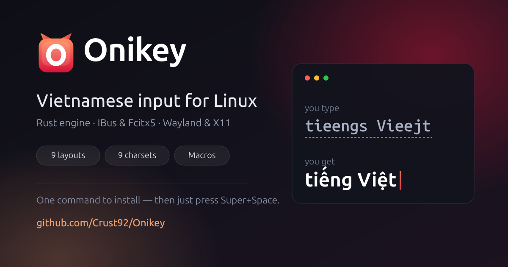

<p align="center">
  
</p>

<p align="center">
  <a href="https://opensource.org/licenses/GPL-3.0"></a>
</p>

Vietnamese IME for **IBus** (GNOME, Ubuntu…) and **Fcitx5** (KDE…), with an
engine written in Rust. The Vietnamese input logic comes from
[BambooEngine](https://github.com/BambooEngine/bamboo-core); this repo stays
**GPLv3**.

## Install

**Fastest — any distro, one line** (downloads the prebuilt binary from GitHub
Releases, verifies its checksum, installs; no compiler, no extra repo):
```sh
curl -fsSL https://raw.githubusercontent.com/Crust92/Onikey/master/scripts/get-onikey.sh | sh
```
For a per-user install without `sudo`:
`curl -fsSL .../get-onikey.sh | ONIKEY_PREFIX=~/.local sh`

**Ubuntu/Debian — install once, `apt upgrade` keeps you current:**
```sh
curl -fsSL https://crust92.github.io/Onikey/onikey-archive-keyring.gpg \
  | sudo tee /usr/share/keyrings/onikey-archive-keyring.gpg >/dev/null
echo "deb [signed-by=/usr/share/keyrings/onikey-archive-keyring.gpg] https://crust92.github.io/Onikey stable main" \
  | sudo tee /etc/apt/sources.list.d/onikey.list
sudo apt update
sudo apt install onikey          # for IBus (GNOME)
sudo apt install fcitx5-onikey   # for Fcitx5 (KDE)
```

Done — press <kbd>Super</kbd>+<kbd>Space</kbd> and type Vietnamese. The package
wakes IBus and appends the input source for you; no logout, no Settings digging.

**From source:**
```sh
sudo apt install -y golang cargo gcc make pkg-config libgtk-3-dev libxtst-dev libx11-dev
git clone https://github.com/Crust92/Onikey.git
cd Onikey && make && sudo make install PREFIX=/usr && ibus restart
```
Pick it under *Settings → Keyboard → Input Sources → + → Vietnamese → Onikey*.
Remove with `sudo make uninstall`. For non-`/usr` installs pass `PREFIX=`; on
Fedora add `LIBEXECDIR=/usr/libexec/onikey`.

## Features

**Input methods:** Telex, Telex 2, Telex W, VNI, VIQR, Telex + VNI, Telex +
VNI + VIQR, Microsoft layout, VNI French keyboard. Default: **Telex 2**.

**Charsets:** Unicode (default), TCVN3 (ABC), VNI Windows, VISCII, VIQR,
BKHCM 1, BKHCM 2, Vietware X, Vietware Full.

**Two display modes while composing:**
- *Pre-edit* (default) — the word being typed is underlined and committed on
  space. Reliable under any load.
- *No underline* — characters go straight into the app and the engine rewrites
  them as tones are added. Enabled only where the app really supports it; apps
  that don't fall back to Pre-edit instead of swallowing keys.

**No underline in browser address bars** — the address bar types without an
underline (so URL suggestions keep working) while every other field stays in
Pre-edit. Toggle it from the menu while in Pre-edit mode.

**Foreign-word restore** — `expression`, `password` typed mid-sentence come out
intact: once a string is no longer a valid Vietnamese syllable, the engine
returns exactly the keys you pressed. The `dd` → `đ` abbreviation is preserved.

**Macros** — `~/.config/onikey/onikey.macro.text`, one `key:text` per line.
With *auto-capitalize*, the expansion follows how you typed the key:
`vn` → Việt Nam, `VN` → VIỆT NAM, `Vn` → Việt Nam.

**Shortcuts** — VN/EN switch (type English without changing input source) and
restore keystrokes (turn the word being composed back into the exact keys you
pressed). Assign the key combinations in the settings dialog.

## Usage

Click the `vi` indicator in the system tray:

```
Bảng mã            ›   charset
Kiểu gõ            ›   input method
Gõ tắt             ›   macros
Kiểm tra chính tả  ›   spell check
Cài đặt khác       ›   display modes
Hộp thoại cấu hình     settings dialog
```
(The UI is in Vietnamese.)

Changes apply instantly — no restart. Editing the config file by hand works
too; the engine watches its mtime and reloads.

## Under the hood

- **Behavioral parity with BambooEngine, proven.** A corpus of 126,831 cases
  records the Vietnamese string **after every keystroke** (not just the final
  result) across 9 input methods and 4 flag combinations; CI reruns it on every
  push. Charset tables are verified against 134,521 cases with zero drift.
- **Knows what kind of field you're in.** Since IBus 1.5 the field type
  (URL/email/password) arrives as the DBus property `ContentType`; Onikey
  implements `Properties.Set`, which is how it recognizes address bars.
- **Fast typing without tone glitches.** In no-underline mode, after deleting
  text the engine **waits for the app to acknowledge** before writing the
  replacement (60ms cap) — no more `password` → `passsowrd`.
- **Defends itself against difficult apps.** A field that swallows delete
  requests (some browsers over Wayland text-input) is detected on the very
  first word; the engine compensates and switches that field to Pre-edit.
  Per-app measurements live in [docs/APP-COMPAT.md](docs/APP-COMPAT.md).
- **The GUI can't take the engine down.** The settings dialog is a separate
  process; the engine links against libc only.

Layout:
```
rust/onikey-core      pure Vietnamese core (no I/O, zero dependencies)
rust/onikey-core-ffi  C ABI: libonikey_core.{a,so} + include/onikey.h
rust/onikey-ibus      IBus engine (zbus) — binary onikey-engine-rs
goengine/             fallback Go engine + GTK glue
ui/, cmd/             settings dialog (GTK), a separate process
fcitx5/               Fcitx5 addon (C++), same core via the C ABI
```

## Troubleshooting

The engine is launched by ibus-daemon, so there is no stdout to read. Enable
logging:
```sh
touch ~/.config/onikey/onikey-debug && ibus restart
```
It writes `~/.config/onikey/onikey-rust-debug.log`: the config it loaded, every
key and the action taken. Remove the flag file and `ibus restart` to turn it
off (off by default).

**On GNOME Wayland** two platform limits apply, neither is an IME bug: the
focused application cannot be identified (so there are no per-app profiles —
Onikey decides from what the app declares about itself), and synthetic key
injection is unavailable (no XTestFakeKeyEvent mode as on X11).

**KDE/Fcitx5:** if typing works in one app but not another, set
`ShareInputState=All` in *Fcitx5 Configuration → Advanced*.

## License

GPLv3, same as [ibus-bamboo](https://github.com/BambooEngine/ibus-bamboo) and
[bamboo-core](https://github.com/BambooEngine/bamboo-core), from which Onikey
inherits its input logic. See [LICENSE](LICENSE).
